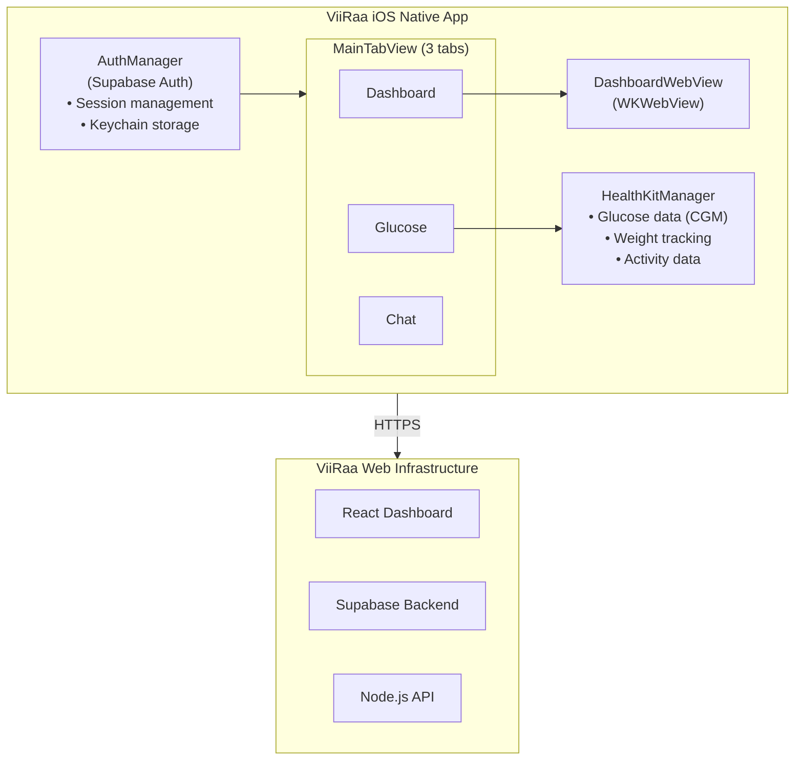

# ViiRaa iOS Application

## Project Overview

ViiRaa is a native iOS health and wellness application that combines glucose monitoring, weight tracking, and personalized coaching to help users master their metabolism. The app integrates Apple HealthKit with a web-based dashboard to provide comprehensive health insights.

**Current Status**: Phase 2 Complete - Ready for TestFlight and App Store Submission

---

## Table of Contents

1. [Onboarding Guide](#onboarding-guide) (New Team Members Start Here)
2. [Project Structure](#project-structure)
3. [Technical Architecture](#technical-architecture)
4. [Key Features](#key-features)
5. [Documentation Guide](#documentation-guide)
6. [Quick Start](#quick-start)
7. [Development Workflow](#development-workflow)
8. [Build &amp; Deployment](#build--deployment)
9. [Troubleshooting](#troubleshooting)

---

## Onboarding Guide

**For New Team Members**: This section provides a quick overview of 4 active projects to help you get started quickly. These projects were initiated and developed by Barack (hongyang@uw.edu), who created the foundational architecture and documentation for this codebase. Feel free to reach out for questions about the original implementation.

### Project 1: ViiRaa iOS App

| Item                        | Details                                                                                                             |
| --------------------------- | ------------------------------------------------------------------------------------------------------------------- |
| **Previous Owner**    | Barack                                                                                                              |
| **Overall Plan**      | Build a native iOS health and wellness app combining glucose monitoring, weight tracking, and personalized coaching |
| **Current Progress**  | Phase 2 Complete (HealthKit integration done). Ready for TestFlight and App Store submission                        |
| **Main Difficulties** | Swift 6 concurrency compliance, App Store approval strategy, WebView-native communication                           |
| **Research & Docs**   | See documentation list below                                                                                        |

**Documentation for Project 1:**

| Document                                                                                | Description                       | Last Updated |
| --------------------------------------------------------------------------------------- | --------------------------------- | ------------ |
| [Product_Requirement_Document.md](Product_Requirement_Document.md)                         | Product vision and specifications | Dec 22, 2025 |
| [Software_Development_Document.md](Software_Development_Document.md)                       | Technical architecture and design | Dec 22, 2025 |
| [Learnings_From_Doing.md](Learnings_From_Doing.md)                                         | Bug fixes and lessons learned     | Dec 22, 2025 |
| [Xcode/SWIFT6_FIXES.md](Xcode/SWIFT6_FIXES.md)                                             | Swift 6 concurrency fixes         | Oct 21, 2025 |
| [Xcode/HEALTHKIT_INTEGRATION_GUIDE.md](Xcode/HEALTHKIT_INTEGRATION_GUIDE.md)               | HealthKit architecture details    | Nov 21, 2025 |
| [Xcode/HEALTHKIT_IMPLEMENTATION_SUMMARY.md](Xcode/HEALTHKIT_IMPLEMENTATION_SUMMARY.md)     | HealthKit feature summary         | Nov 21, 2025 |
| [Xcode/HEALTHKIT_QUICK_START.md](Xcode/HEALTHKIT_QUICK_START.md)                           | 5-minute HealthKit setup          | Nov 21, 2025 |
| [Xcode/CRITICAL_STATISTICS_IMPLEMENTATION.md](Xcode/CRITICAL_STATISTICS_IMPLEMENTATION.md) | Critical glucose metrics feature  | Oct 27, 2025 |
| [Credentials.md](Credentials.md)                                                           | API keys and credentials (shared) | Dec 9, 2025  |

### Project 2: Sync ViiRaa iOS App Data to Junction

| Item                        | Details                                                                                                    |
| --------------------------- | ---------------------------------------------------------------------------------------------------------- |
| **Previous Owner**    | Barack                                                                                                     |
| **Overall Plan**      | Sync health data collected from iOS app (HealthKit) to Junction backend for centralized data processing    |
| **Current Progress**  | Junction SDK integrated. API key renewal process documented                                                |
| **Main Difficulties** | 3-hour data delay from Junction, API key expiration (1 week shelf life), real-time vs batch sync decisions |
| **Research & Docs**   | See documentation list below                                                                               |

**Documentation for Project 2:**

| Document                                                                          | Description                                      | Last Updated |
| --------------------------------------------------------------------------------- | ------------------------------------------------ | ------------ |
| [3rd_Party_Bio_Data_Integration_Report.md](3rd_Party_Bio_Data_Integration_Report.md) | Research on Junction SDK, BLE, and cloud storage | Nov 20, 2025 |
| [JUNCTION_API_KEY_RENEWAL.md](JUNCTION_API_KEY_RENEWAL.md)                           | Guide for renewing expired Junction API keys     | Dec 2, 2025  |
| [Deployment_Guide.md](Deployment_Guide.md)                                           | Junction SDK Integration (Section 9)             | Dec 22, 2025 |
| [Credentials.md](Credentials.md)                                                     | Junction API keys (shared)                       | Dec 9, 2025  |

### Project 3: BLE Scheme

| Item                        | Details                                                                                                            |
| --------------------------- | ------------------------------------------------------------------------------------------------------------------ |
| **Previous Owner**    | Barack                                                                                                             |
| **Overall Plan**      | Implement Bluetooth Low Energy (BLE) connectivity for direct CGM device pairing (Abbott Lingo sensors)             |
| **Current Progress**  | BLE Follow Mode implemented. Core BLE service layer complete with CoreBluetooth integration                        |
| **Main Difficulties** | Proprietary CGM protocols (no reverse engineering), background BLE operations, cross-validation with Junction data |
| **Research & Docs**   | See documentation list below                                                                                       |

**Documentation for Project 3:**

| Document                                                                          | Description                            | Last Updated |
| --------------------------------------------------------------------------------- | -------------------------------------- | ------------ |
| [BLE_IMPLEMENTATION_SUMMARY.md](BLE_IMPLEMENTATION_SUMMARY.md)                       | BLE Follow Mode implementation details | Dec 2, 2025  |
| [3rd_Party_Bio_Data_Integration_Report.md](3rd_Party_Bio_Data_Integration_Report.md) | BLE research and CGM device analysis   | Nov 20, 2025 |
| [Software_Development_Document.md](Software_Development_Document.md)                 | BLE specs in lines 1553-2039           | Dec 22, 2025 |

### Project 4: ViiRaa iOS App Store Submission

| Item                        | Details                                                                                            |
| --------------------------- | -------------------------------------------------------------------------------------------------- |
| **Previous Owner**    | Barack                                                                                             |
| **Overall Plan**      | Submit app to TestFlight for internal testing, then to App Store for public release                |
| **Current Progress**  | **REJECTED** on Dec 3, 2025. See rejection reasons and solutions below                             |
| **Main Difficulties** | App Store review guidelines compliance, HealthKit usage justification, privacy policy requirements |
| **Research & Docs**   | See documentation list below                                                                       |

**App Store Rejection Summary (Dec 3, 2025):**

| Guideline | Issue | Solution |
|-----------|-------|----------|
| **4.8 - Login Services** | App uses Google OAuth but doesn't offer Sign in with Apple | Implement "Sign in with Apple" as an equivalent login option |
| **2.3.3 - Accurate Metadata** | iPad screenshots only show login screen | Upload screenshots showing app's core features (glucose tracking, dashboard) |
| **4.0 - Design** | UI is crowded/difficult to use on iPad Air (5th gen) | Improve iPad layout responsiveness and readability |
| **5.1.1(v) - Account Deletion** | No option to delete user account | Add account deletion feature in app settings |

**Documentation for Project 4:**

| Document                                                                       | Description                                        | Last Updated |
| ------------------------------------------------------------------------------ | -------------------------------------------------- | ------------ |
| [Deployment_Guide.md](Deployment_Guide.md)                                     | Complete deployment guide (TestFlight + App Store) | Dec 22, 2025 |
| [Xcode/ARCHIVE_BUILD_FIX_GUIDE.md](Xcode/ARCHIVE_BUILD_FIX_GUIDE.md)           | Archive build troubleshooting                      | Oct 27, 2025 |
| [Product_Requirement_Document.md](Product_Requirement_Document.md)             | App Store approval strategy                        | Dec 22, 2025 |
| [251202-App_Store_Submission_Results.html](251202-App_Store_Submission_Results.html) | **Full rejection details from Apple** (must read)  | Dec 2, 2025  |

### Recommended Reading Order for New Team Members

1. **This README** - Get the full picture
2. **[HEALTHKIT_QUICK_START.md](Documentation/HEALTHKIT_QUICK_START.md)** - 5-minute setup guide
3. **[Implementation_Guide.md](Documentation/Implementation_Guide.md)** - Step-by-step development setup
4. **[Learnings_From_Doing.md](Documentation/Learnings_From_Doing.md)** - Common issues and solutions

---

## Project Structure

```
Xcode/
├── Xcode.xcodeproj/              # Xcode project configuration
├── Xcode/                        # Main application source code
│   ├── App/
│   │   └── ViiRaaApp.swift      # App entry point
│   ├── Core/
│   │   ├── Authentication/       # Supabase authentication integration
│   │   │   ├── AuthManager.swift
│   │   │   ├── AuthView.swift
│   │   │   ├── SupabaseClient.swift
│   │   │   └── KeychainManager.swift
│   │   ├── Navigation/
│   │   │   └── MainTabView.swift # Tab-based navigation
│   │   └── WebView/
│   │       └── DashboardWebView.swift # WKWebView integration
│   ├── Features/
│   │   ├── Dashboard/            # Main dashboard view
│   │   ├── HealthKit/            # ✅ HealthKit integration (Phase 2)
│   │   │   ├── GlucoseView.swift
│   │   │   └── HealthKitPermissionView.swift
│   │   └── Chat/                 # Chat placeholder (Phase 3)
│   ├── Services/
│   │   ├── HealthKit/            # ✅ HealthKit data management
│   │   │   ├── HealthKitManager.swift
│   │   │   └── HealthDataModels.swift
│   │   └── Analytics/
│   │       └── AnalyticsManager.swift # PostHog integration
│   ├── Models/
│   │   ├── User.swift
│   │   └── Session.swift
│   ├── Utilities/
│   │   ├── Constants.swift
│   │   └── Extensions/
│   └── Resources/
│       ├── Assets.xcassets
│       ├── Info.plist
│       └── 251015-Xcode.entitlements
│
└── Documentation/
    ├── Product_Requirement_Document.md       # Product specifications
    ├── Software_Development_Document.md      # Technical design document
    ├── Implementation_Guide.md               # Step-by-step implementation guide
    ├── HEALTHKIT_INTEGRATION_GUIDE.md        # HealthKit integration details
    ├── HEALTHKIT_IMPLEMENTATION_SUMMARY.md   # HealthKit feature summary
    ├── HEALTHKIT_QUICK_START.md              # 5-minute HealthKit setup
    ├── CRITICAL_STATISTICS_IMPLEMENTATION.md # Critical glucose metrics feature
    ├── SWIFT6_FIXES.md                       # Swift 6 concurrency fixes
    ├── ARCHIVE_BUILD_FIX_GUIDE.md            # Archive build troubleshooting
    └── Learnings_From_Doing.md               # Bug fixes and learnings
```

---

## Technical Architecture

### Technology Stack

#### Native iOS Layer

- **Language**: Swift 5.9+
- **UI Framework**: SwiftUI
- **Minimum iOS**: 14.0
- **Target Devices**: iPhone (primary), iPad (compatible)

#### Backend Integration

- **Authentication**: Supabase Auth (OAuth + Email/Password)
- **Database**: Supabase PostgreSQL
- **API**: Node.js backend on Railway
- **Analytics**: PostHog

#### Native iOS Features

- **HealthKit**: Apple HealthKit framework for health data access
- **Keychain**: Secure token storage
- **WebView**: WKWebView for dashboard integration
- **JavaScript Bridge**: Native-web communication

### Application Architecture



---

## Key Features

### Phase 1: MVP - Dashboard Integration ✅

- ✅ Native iOS app shell with tab-based navigation
- ✅ WebView integration loading web dashboard
- ✅ Supabase authentication (Google OAuth + Email/Password)
- ✅ Secure session management with Keychain
- ✅ Single sign-on between native and web
- ✅ JavaScript bridge for native-web communication
- ✅ PostHog analytics integration

### Phase 2: HealthKit Integration ✅ **COMPLETE**

- ✅ Apple HealthKit authorization and permissions
- ✅ CGM data reading (continuous glucose monitoring)
- ✅ Weight tracking
- ✅ Activity data (steps, energy, exercise minutes)
- ✅ Native glucose data display view with:
  - **Critical Statistics Card** emphasizing:
    - **Time In Range (70-180 mg/dL)** - PRIMARY METRIC for weight loss (48pt font)
    - **Peak Glucose** - MOST DAMAGING metric (42pt font with warning colors)
  - Interactive glucose trend charts
  - Recent readings list
  - Multi-timeframe views (today, week, month)
- ✅ Glucose statistics and analytics
- ✅ WebView data injection for dashboard access

### Phase 3: Future Enhancements

- [ ] miniViiRaa AI coach chat integration
- [ ] Push notifications for engagement
- [ ] Offline functionality
- [ ] Native UI components migration
- [ ] Apple Watch integration

---

## Documentation Guide

### Essential Reading

1. **[Product_Requirement_Document.md](Xcode/Product_Requirement_Document.md)**

   - Product vision and goals
   - Target audience and user personas
   - Feature specifications and scope
   - App Store approval strategy
   - Authentication requirements
   - Dual submission strategy (TestFlight + App Store)
2. **[Software_Development_Document.md](Xcode/Software_Development_Document.md)**

   - Complete technical architecture
   - Implementation details for all components
   - Security and privacy considerations
   - Testing strategy
   - Deployment procedures
   - Troubleshooting guide with SDK fixes
3. **[Implementation_Guide.md](Xcode/Implementation_Guide.md)**

   - Step-by-step setup instructions
   - Xcode project creation
   - Dependencies installation (Swift Package Manager)
   - Configuration walkthrough
   - Development workflow
   - TestFlight deployment steps
   - App Store submission process

### HealthKit Documentation

4. **[HEALTHKIT_QUICK_START.md](Xcode/HEALTHKIT_QUICK_START.md)**

   - 5-minute setup guide
   - Quick configuration steps
   - Testing with simulator data
   - Common issues and fixes
5. **[HEALTHKIT_INTEGRATION_GUIDE.md](Xcode/HEALTHKIT_INTEGRATION_GUIDE.md)**

   - Complete HealthKit architecture
   - Detailed API documentation
   - Web integration examples
   - Testing checklist
   - App Store submission notes
6. **[HEALTHKIT_IMPLEMENTATION_SUMMARY.md](Xcode/HEALTHKIT_IMPLEMENTATION_SUMMARY.md)**

   - Implementation status (100% complete)
   - Files created and modified
   - Next steps for developers
   - Testing checklist
   - App Store readiness
7. **[CRITICAL_STATISTICS_IMPLEMENTATION.md](Xcode/CRITICAL_STATISTICS_IMPLEMENTATION.md)**

   - Critical glucose metrics feature
   - Time In Range emphasis (primary metric for weight loss)
   - Peak Glucose warnings (most damaging metric)
   - Visual design and UX benefits

### Troubleshooting Documentation

8. **[SWIFT6_FIXES.md](Xcode/SWIFT6_FIXES.md)**

   - Swift 6 concurrency fixes
   - ObservableObject conformance with MainActor
   - Explicit capture lists for closures
   - Supabase SDK deprecation fixes
9. **[ARCHIVE_BUILD_FIX_GUIDE.md](Xcode/ARCHIVE_BUILD_FIX_GUIDE.md)**

   - Provisioning profile setup
   - Code signing configuration
   - Bundle identifier fixes
   - Archive build troubleshooting
10. **[Learnings_From_Doing.md](Xcode/Learnings_From_Doing.md)**

    - 11 documented bugs and their solutions
    - SDK integration best practices
    - Authentication state management
    - Session sharing patterns
    - Generic type inference issues
    - Build configuration problems

---

## Quick Start

### Prerequisites

- macOS 13.0+ (Ventura or later)
- Xcode 14.0+
- Apple Developer Account
- Supabase project credentials
- PostHog API key

### Setup Steps

1. **Clone and Open Project**

   ```bash
   cd /Users/barack/Downloads/Xcode
   open Xcode.xcodeproj
   ```
2. **Enable HealthKit Capability** ⚠️ **REQUIRED**

   - Select `Xcode` target
   - Go to **Signing & Capabilities** tab
   - Click **+ Capability**
   - Add **HealthKit**
3. **Configure Signing**

   - Enable "Automatically manage signing"
   - Select your Development Team
   - Bundle Identifier: `com.viiraa.app`
4. **Update Constants**

   - Open [Xcode/Utilities/Constants.swift](Xcode/Utilities/Constants.swift)
   - Add your Supabase URL and Anon Key
   - Add your PostHog API Key
5. **Build and Run**

   ```
   Cmd+R
   ```
6. **Test HealthKit**

   - Grant permissions when prompted
   - Open Health app and add test data:
     - Blood Glucose: 120 mg/dL
     - Body Mass: 150 lbs
     - Steps: 5000 steps
   - Return to ViiRaa app and verify data displays

For detailed setup instructions, see [Implementation_Guide.md](Xcode/Implementation_Guide.md).

---

## Development Workflow

### Running the App

1. Select simulator or device (iPhone 15 Pro recommended)
2. Press `Cmd+R` to build and run
3. Test authentication flow
4. Verify HealthKit data integration
5. Check WebView dashboard loading

### Testing WebView Integration

1. Open Safari Web Inspector:
   - Safari → Develop → [Your Simulator] → localhost
2. Test JavaScript bridge:
   ```javascript
   // Check health data injection
   console.log(window.iosHealthData);

   // Request fresh data
   window.webkit.messageHandlers.nativeApp.postMessage({
     type: 'requestHealthData'
   });
   ```

### Code Architecture

#### Authentication Flow

1. User launches app
2. `AuthManager` checks Keychain for session
3. If no session, show `AuthView`
4. User authenticates via Supabase
5. Session stored in Keychain
6. Session injected into WebView for SSO
7. Dashboard loads with authenticated state

#### HealthKit Data Flow

1. `HealthKitManager` requests authorization
2. User grants permissions
3. App fetches glucose, weight, activity data
4. Data displayed in native `GlucoseView`
5. Data injected into WebView as `window.iosHealthData`
6. Web dashboard receives `ios-health-data-ready` event

---

## Build & Deployment

### TestFlight Deployment

1. **Archive the App**

   - Select "Any iOS Device (arm64)"
   - Product → Archive
   - Wait for completion (5-10 minutes)
2. **Upload to App Store Connect**

   - Organizer → Distribute App
   - Select "App Store Connect"
   - Upload and wait for processing
3. **Configure TestFlight**

   - Go to App Store Connect → TestFlight
   - Add internal testers (e.g., Lei: zl.stone1992@gmail.com)
   - Provide export compliance info
   - Send invitations
4. **Testers Install**

   - Install TestFlight app
   - Accept invitation email
   - Install and test ViiRaa app

### App Store Submission

**Current Strategy**: Dual submission approach

- Submit to **TestFlight** for internal testing
- Submit to **App Store** to identify any approval gaps early

**Key Requirements for Approval**:

- ✅ HealthKit integration (demonstrates native iOS functionality)
- ✅ Native UI shell (tab navigation, permission prompts)
- ✅ Privacy policy URL
- ✅ App Store screenshots
- ✅ App Review Notes explaining HealthKit value

See [Implementation_Guide.md](Xcode/Implementation_Guide.md) for detailed submission process.

---

## Troubleshooting

### Common Issues

#### 1. Build Error: "Cannot find type 'HKHealthStore'"

**Solution**: Enable HealthKit capability in Xcode project settings.

#### 2. Archive Fails: "No profiles for 'com.viiraa.app'"

**Solution**:

- Enable automatic signing in Signing & Capabilities
- Select your development team
- Verify bundle identifier is `com.viiraa.app`
- See [ARCHIVE_BUILD_FIX_GUIDE.md](Xcode/ARCHIVE_BUILD_FIX_GUIDE.md)

#### 3. White Screen on Launch

**Solution**: Check that `AuthManager.isLoading` is being set to false. See Bug #6 in [Learnings_From_Doing.md](Xcode/Learnings_From_Doing.md).

#### 4. Double Login Required

**Solution**: Verify session injection is working correctly. Check WebView console for `window.iosHealthData`. See Bug #7 in [Learnings_From_Doing.md](Xcode/Learnings_From_Doing.md).

#### 5. HealthKit Data Not Appearing

**Solution**:

- Verify permissions were granted (Settings → Privacy → Health → ViiRaa)
- Add test data in Health app
- Check console logs for injection confirmation
- Verify `Constants.isHealthKitEnabled == true`

#### 6. Swift 6 Concurrency Errors

**Solution**: See [SWIFT6_FIXES.md](Xcode/SWIFT6_FIXES.md) for detailed solutions to:

- ObservableObject conformance issues
- Capture list requirements
- MainActor isolation patterns

### Complete Troubleshooting Resources

- **Build Errors**: [Learnings_From_Doing.md](Xcode/Learnings_From_Doing.md) - 11 documented bugs
- **Archive Issues**: [ARCHIVE_BUILD_FIX_GUIDE.md](Xcode/ARCHIVE_BUILD_FIX_GUIDE.md)
- **HealthKit Issues**: [HEALTHKIT_INTEGRATION_GUIDE.md](Xcode/HEALTHKIT_INTEGRATION_GUIDE.md) - Troubleshooting section
- **Swift Errors**: [SWIFT6_FIXES.md](Xcode/SWIFT6_FIXES.md)

---

## Project Configuration

### Bundle Information

- **Bundle Identifier**: `com.viiraa.app`
- **App Name**: ViiRaa
- **Team ID**: 934S9W736Z
- **Minimum iOS**: 14.0
- **Target Devices**: iPhone, iPad

### Dependencies (Swift Package Manager)

- **Supabase Swift SDK**: v2.5.1+
- **PostHog iOS SDK**: v3.34.0+

### Capabilities Required

- ✅ HealthKit (REQUIRED for Phase 2)
- ✅ Keychain Sharing
- ✅ Associated Domains (for OAuth)
- ✅ Background Modes (for future features)

### Environment Variables

Required in [Xcode/Utilities/Constants.swift](Xcode/Utilities/Constants.swift):

- `supabaseURL`: Supabase project URL
- `supabaseAnonKey`: Supabase anonymous key
- `posthogAPIKey`: PostHog project API key
- `isHealthKitEnabled`: Feature flag (true for Phase 2)

---

## Success Metrics

### Phase 1 Success Criteria (MVP) ✅

- [X] TestFlight build deployed for internal testing
- [X] Users can authenticate using existing credentials
- [X] Dashboard loads and functions correctly in WebView
- [X] No critical bugs or crashes
- [X] PostHog analytics tracking mobile sessions
- [X] Single sign-on working (no double login)

### Phase 2 Success Criteria (HealthKit) ✅

- [X] Apple HealthKit integration implemented
  - [X] CGM data read capability
  - [X] Weight tracking read capability
  - [X] Activity/fitness data read capability
  - [X] Native glucose data display view
  - [X] Interactive glucose charts
  - [X] Critical statistics emphasized (Time In Range + Peak Glucose)
- [X] Native iOS features demonstrate value for App Store approval
- [ ] App successfully submitted to TestFlight (NEXT STEP)
- [ ] App successfully submitted to App Store (NEXT STEP)

### Phase 3 Success Criteria (Future)

- [ ] miniViiRaa AI coach chat integration
- [ ] Push notifications implemented
- [ ] Users can send/receive messages within app
- [ ] Migration from Telegram completed

---

## Contact & Resources

### Internal Team

- **Product Manager**: Lei (zl.stone1992@gmail.com)
- **TestFlight Beta Tester**: Lei (internal testing)

### External Resources

- [Apple Developer Portal](https://developer.apple.com)
- [App Store Connect](https://appstoreconnect.apple.com)
- [Supabase Dashboard](https://app.supabase.com)
- [PostHog Dashboard](https://us.posthog.com/project/224201)
- [ViiRaa Website](https://viiraa.com)

### Documentation Links

- [Apple HealthKit Documentation](https://developer.apple.com/documentation/healthkit)
- [App Store Review Guidelines](https://developer.apple.com/app-store/review/guidelines/)
- [Supabase Swift SDK](https://github.com/supabase/supabase-swift)
- [PostHog iOS SDK](https://posthog.com/docs/libraries/ios)

---

## Project Timeline

- **2025-10-12**: Project started, PRD and SDD created
- **2025-10-15**: Phase 1 MVP implemented, initial build issues resolved
- **2025-10-20**: Authentication and session management improvements
- **2025-10-21**: Phase 2 HealthKit integration completed
- **2025-10-27**: Critical statistics feature added, archive build fixes
- **Next**: TestFlight and App Store submission

---

## License & Privacy

- **Privacy Policy**: [https://www.viiraa.com/ViiRaa_Privacy_Policy_Notice_US_20250808.pdf](https://www.viiraa.com/ViiRaa_Privacy_Policy_Notice_US_20250808.pdf)
- **Health Data**: Never shared with third parties, stored securely in Apple HealthKit
- **User Data**: Encrypted in transit (HTTPS) and at rest (Keychain)
- **HIPAA Considerations**: Health data handling follows best practices
- **GDPR Compliance**: User data privacy and consent mechanisms in place

---

## Version History

**Current Version**: 1.0.0 (Build 1)

### v1.0.0 (Phase 2 Complete)

- ✅ WebView-based dashboard with native shell
- ✅ Supabase authentication (Google OAuth + Email/Password)
- ✅ Single sign-on between native and web
- ✅ Apple HealthKit integration
  - Glucose monitoring (CGM)
  - Weight tracking
  - Activity data
  - Critical statistics emphasis (Time In Range + Peak Glucose)
- ✅ Native glucose visualization with charts
- ✅ PostHog analytics integration
- ✅ Tab-based navigation (Dashboard, Glucose, Chat placeholder)
- ✅ JavaScript bridge for native-web communication

---

## Contributing

This is a private project. For issues or questions:

1. Check the [Learnings_From_Doing.md](Xcode/Learnings_From_Doing.md) for common issues
2. Review relevant documentation files
3. Contact the project lead

---

## Acknowledgments

- **Product Design & iOS Development**: Barack (hongyang@uw.edu)
- **Development**: Claude Code (AI Assistant)
- **Testing**: Internal ViiRaa Team
- **Feedback**: Lei

---

**Last Updated**: December 23, 2025
**Documentation Version**: 1.1
**Project Status**: Phase 2 Complete - Ready for Deployment
